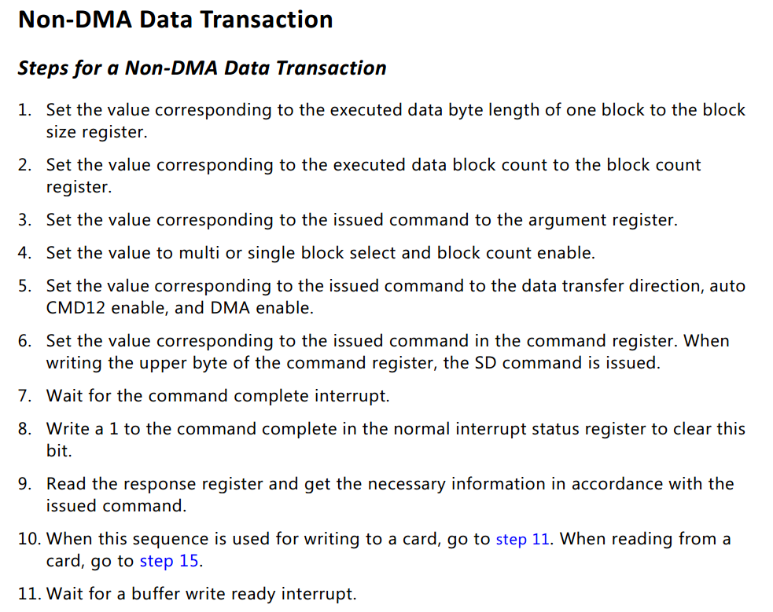
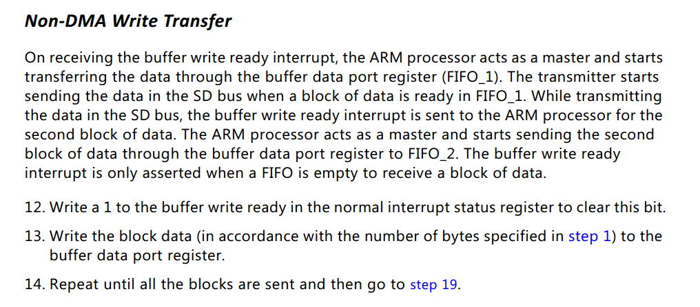
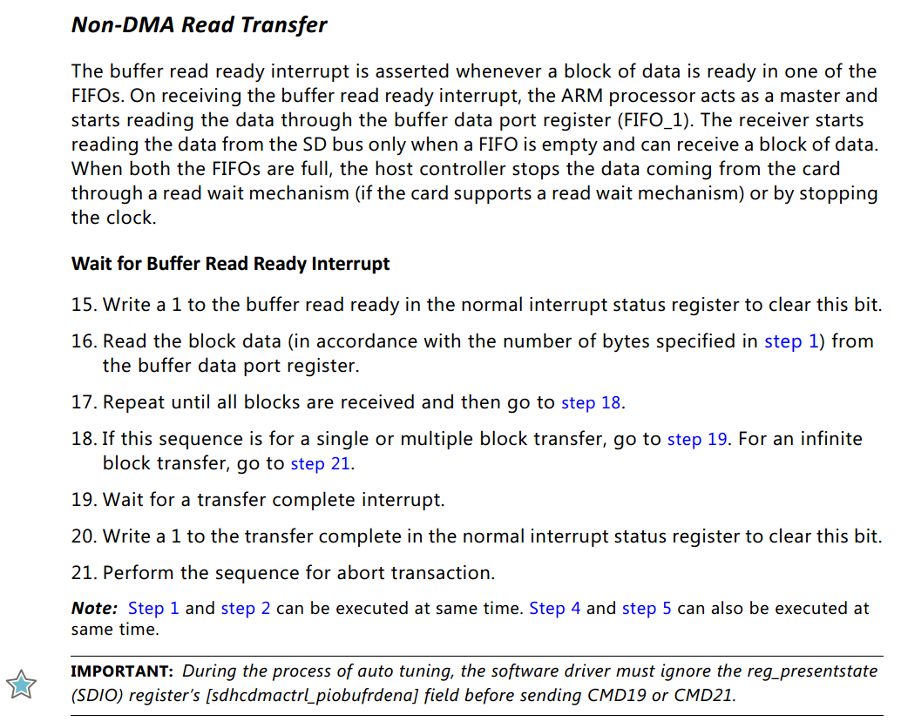
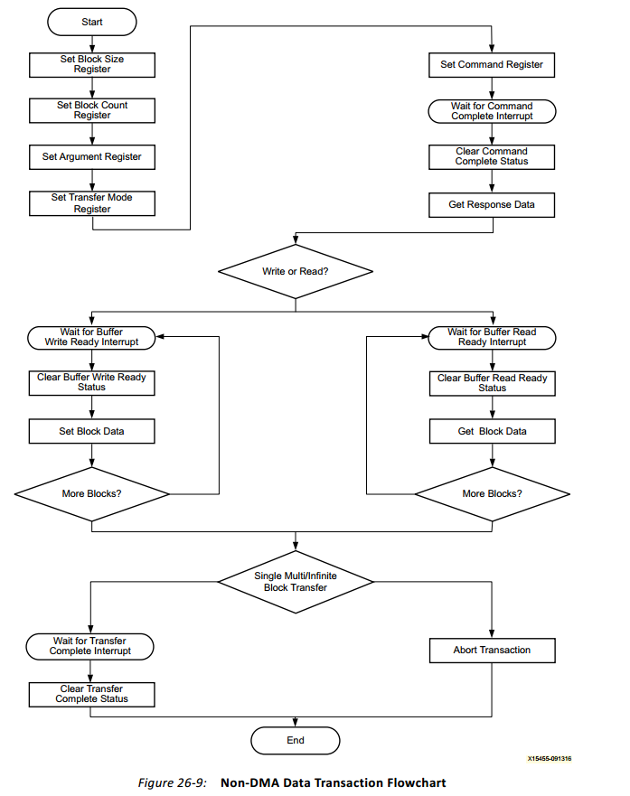

# SDIO 技术手册

# 如何获取SDIO的手册

# SDIO的体系架构
SDIO是一种插卡的标准，所有SD卡从设备能够通过SPI外设访问，如果主机有SDIO插口，则SD卡还能从SD Host Control设备访问。

本技术手册主要描述通过SD Host Control设备访问SD卡。

# SDIO的操作预览

# 获取配置信息


静态信息：通过init能够设置的，不需要每次都读取寄存器的信息
_baseAddress
_hostControlVersion

_cardInserted 
_capabilities
_clockFreq
_blockSize
_relativeCardAddress 
_cardSpecData
_secCount
_cardID
_baseClockFreq
_cardVersion


动态信息：
_transferMode

# 注记
RO
ROC  ： ReadOnly status,write ignored,reset=0
RW
RW1C : ReadOnly status,Write 1 to clear,write 0 ignored.
RWAC : RW,automic clear register
res0: reserved as 0
Rsvd : init=0, write ignored
WO : Write Only address

如果写入RO,ROC的位，则应当视为写入0，以便将来可能会用到新的定义。

# 寄存器框架
## Transfer Mode Register -- 0xC -- 16bits
D15-D06:res0
D05: Multi/Single Block
D04: Data Transfer  Direction,1==CardToHost,0==HostToCard, 仅当从SD卡读取数据时设置为1
D03-D02: Auto CMD Enable, Rsvd
D01:Block Count Enable, 是否允许使用Block Count寄存器
D00: DMA Enable

当D05=0时，模式是单个转换， 则block count相关的都是无关紧要的。

在CMD17（读取单个块）时，设置为D04=1
在CMD24（写入单块）时，应当全部为0
## Software Reset Register -- 0x2F 
D07-D03:res0  D02:reset for DAT line  D01:reset for CMD line  D00:for ALL

操作该寄存器： 写入相应位为1时，产生一个脉冲，将对应的所有寄存器初始化为初始状态。
在写入完成之前，需要不断读取该相应的位直到为0

## Power Control Register -- 0x29
D07-D04:res0  D03-D01:SD Bus Voltage Select(111:3v3 110:3v 101:1.8v else:reserved) D00:SD Bus Power ON/OFF

在写入D00位之前，应当先选择电压。（在按字节传输的系统中，因为高位先传，所以电压先被选择）。如果没有插入SD卡，该位应当为0，禁用SD Bus总线。

## Host Control 1 Register -- 0x28
D07:    D04-D03: DMA select   D02:Hight/Normal Speed Mode       D01: Data Transfer Width,1=4-bit,0=1-bit mode   D00:LED ON/OFF(一般选择OFF)

D04-D03选择DMA的模式，在Transfer Mode如果DMA Enable=1,则以此作为DMA的模式。
通常值为0b11.

## Present State Register -- 0x24  -- 32bits
D31-D25:res0
D24 : CMD Line Signal Level (for debugging),  RO
D23-D20:  DAT[3:0] (for debugging),RO
...
D17: Card State Is Stable
D16: Card Inserted
D15-D12:res0
D11 : Buffer Read Enable 
D10 : Buffer Write Enable
D09 : Read Transfer Active , 表明是否在传输数据
D08 : Write Transfer Active 
D07-D04: res0
...
D01: Command Inhibit(DAT)  == 是否可以通过DAT线发送命令
D00: Command Inhibit(CMD)  == 是否可以通过CMD线发送数据


如果缓冲区中有剩余的数据，该怎么办？

## Normal Interrupt Status Register -- 0x30 --16bist
D15: Error Interrupt == 任意一种错误发生了,指的是Error Interrupt Status寄存器中的任意一个错误位设置。
D14-D13:res0
D12
D11
D10
D09
D08 :   ROC
D07 : Card Removal, RW1C == 当Present中的Card Inserted 从1变成0时，该位设置
D06 : Card Insertion, RW1C 同D07
D05 : Buffer Read Ready, RW1C == 当Present中的Buffer Read Enable从0变成1时设置
D04 : Buffer Write Ready, RW1C，同D05
D03 : DMA Interrupt
D02 : Block Gap Event
D01 : Transfer Complete, RW1C, 对于读，当Present中的`Read Transfer Active Status`从1变成0时设置，对于写，当Present中的`DAT Line Active Status`从1变成0时设置；对于命令，当命令的busy设置为0时设置
D00 : Command Complete,RW1C == 当接受完response之后，该位设置。

读取block影响的状态位： D05
写入block影响的状态位： D04

注意，仅当Dn=1时，写入1会将其清除；否则，对Dn=0写入1会一直设置该位。

## Error Interrupt Status Register -- 0x32 -- 16bits

清除值： 0xF7FF

# 命令
注：A表示参数
ACMD41  发送主机具有的能力，slave相应OCR(operating condition register)

CMD3   R6

CMD12  R1b   停止数据传送

CMD13  R1   发送cardStatus或者taskStatus,   A[31:16]=RCA,A[15]=0==CardStatus,1==taskStatus, A[14:0]=0 

CMD16  R1   设置block的大小，默认为512.  A[31:0]=block length

CMD17  R1     读取单个块


CMD23  R1   设置CMD18,CMD25的block count的参数

CMD24  R1
# 响应
响应分为SPI和SD两种模式，

下表是SD模式的响应

R1 CardStatus   REP[31:0] = R[39:8] 
R1b CardStatusForAutoCMD12
R3

## CardStatus
D31: OUT_OF_RANGE

# 缓冲区控制
Host控制器有一个内部的缓冲区和一个相应的指针，每当Buffer Data Port端口被访问时，该指针都会进行相应的增加。

当访问该缓冲区时，总是应当按照顺序进行。

buffer最多存放由block size寄存器指定的数目的字节，但是每次从buffer访问都是4字节的。
当指针=block size时，`Buffer Write Enable`在`Present State`中的位从0变成1，表示不允许再写入。
当`Buffer Write Enable=0`时，写入的字节会被忽略。
仅当`Buffer Write Enable`从0变成1时，下一个块数据可写入。
同理，`Buffer Read Enable`从0变成1时，表示数据可用。当读取多余剩余的数据时，多出的部分是未定义的。

`Present State`中的这两位都是读取即清除的。

# 非DMA模式的读写(Xilinx文档截取)
*NOTE: COPYRIGHT from Xilinx 2007-2016*








实现的代码
```c++
size_t   SDDriver::readSingleBlockNoDMA(size_t startSec,void * buffer)
{
	auto oriMode=_transferMode;
	_transferMode = bitOnes<4>();
	// read single block
	if(!transferCommand(CMD17, startSec, 1))
	{
		_transferMode=oriMode;
		return 0;
	}
//	SDCardStatus{reg32<R::reg_response0>()}.dump();


	// 将Buffer Read Ready清除掉
	reg16<R::reg_normalintrsts>() = bitOnes<5>();

	// 读取一个扇区的数据直到完成
	size_t readBytesPer = 4;
	auto typedBuffer = reinterpret_cast<uint32_t*>(buffer);
	size_t nitems=_blockSize/readBytesPer;
	for(size_t i=0;i<nitems;++i)
	{
		typedBuffer[i] = reg32<R::reg_dataport>();
	}

	// UPDATE: 发送CMD12是没有必要的，会引起内部状态的错误。
	// 如果没有设置AUTO CMD12，则手动发送
	// 发送STOP
//	if(!transferCommand(CMD12, 0, 0))return 0;

	// 等待传输完成
	while(bitsNonSet<1>(reg16<R::reg_normalintrsts>()))
		;
	// 清除该位
	reg16<R::reg_normalintrsts>()=bitOnes<1>();

	return 1;
}

size_t    SDDriver::writeSingleBlockNoDMA(size_t startSec,const void *buffer)
{
	auto oriMode=_transferMode;
	_transferMode = 0;

	// write single block
	if(!transferCommand(CMD24, startSec, 1))
	{
		_transferMode = oriMode;
		return 0;
	}
//	SDCardStatus{reg32<R::reg_response0>()}.dump();

	// 等待直到数据可写入
	while(bitsNonSet<4>(reg16<R::reg_normalintrsts>()))
		;
	// 清除
	reg16<R::reg_normalintrsts>() = bitOnes<4>();

	// 写入一个扇区的数据直到完成
	size_t writeBytesPer = 4;
	auto typedBuffer = reinterpret_cast<const uint32_t*>(buffer);
	size_t nitems=_blockSize/writeBytesPer;
	for(size_t i=0;i<nitems;++i)
	{
		 reg32<R::reg_dataport>() = typedBuffer[i];
	}

	// 等待传输完成
	while(bitsNonSet<1>(reg16<R::reg_normalintrsts>()))
		;
	// 清除该位
	reg16<R::reg_normalintrsts>()=bitOnes<1>();

	return 1;
}

```